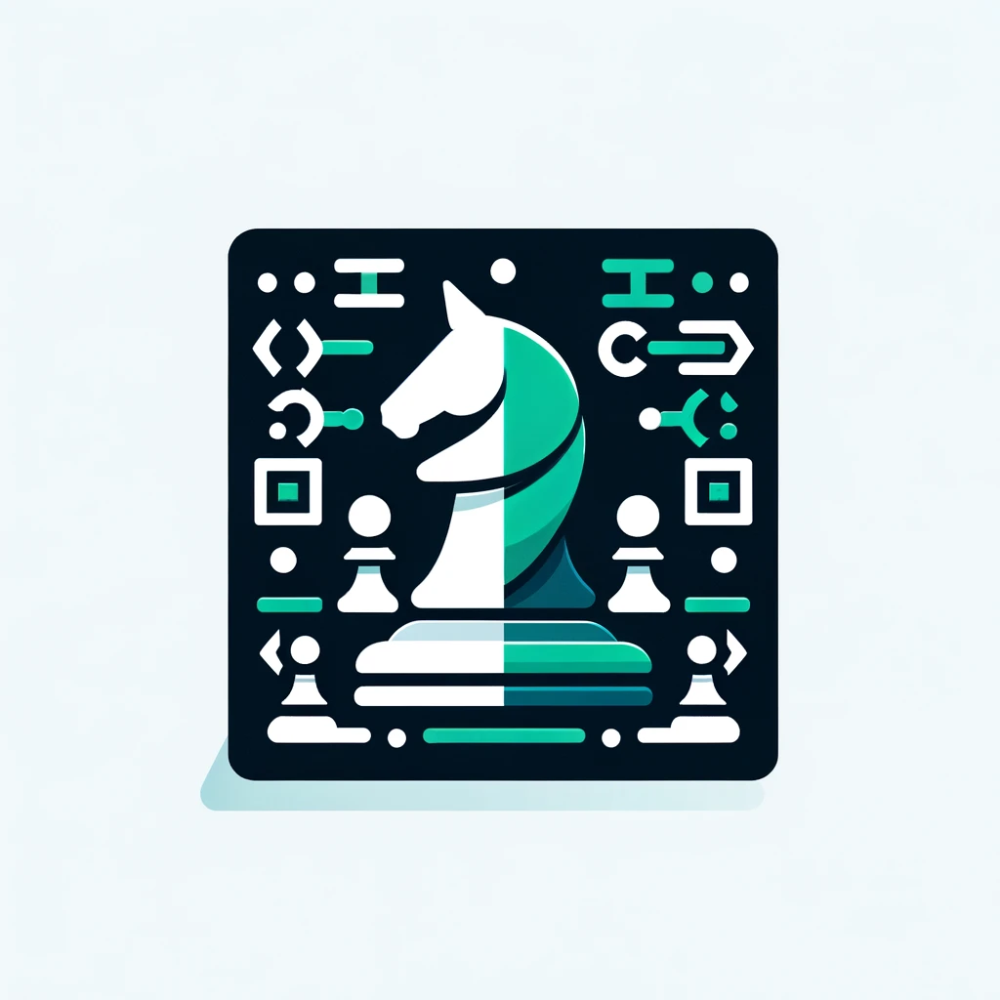

# Chess.com - Front End Programming Challenge

## How to start

- Clone the repository.
- Ensure you have Node.js version 18 or higher installed.
- Install dependencies with npm i.
- Set up `husky` by running `npm run prepare`

## How to run locally

- Start the development server with `npm run dev`.
- Access the application at: http://localhost:5173/

## Running tests

- Run unit tests using `npm run test:unit` with Vitest.
- Check code coverage with `npm run testcoverage:unit`.
- Execute Cypress tests using `npm run cypress:run`. Ensure the local server is running.

## Production build

- Build the application for production with `npm run build`.

## Next steps

#### Navigation

Implement `next` and `prev` buttons in the HistorySidebar navigation section.
Use `activeSquareIndex` for tracking active square.

#### Chessboard

Add board notation as named slots in `ChessboardSquare` component.

## Notes: Application Architecture

For this Vue application, I adopted the standard Vue structure suitable for small to medium-sized projects. This approach supports the straightforward requirements and current scale of chessboard application, where clicking a square highlights it and logs the move to a sidebar.

Should the application's scope expand, I would plan to transition to a more modular architecture. This would involve a `modules` folder where each module contains its own set of components, store, routes, translations, and types dedicated to specific features. A central components folder would remain to house shared UI elements like `BaseButton` and `BaseInput`.

## Notes: GIT

GIT Remote Origin was removed.

origin: git@github.com:ChessCom/frontendtest.git (fetch)

origin: git@github.com:ChessCom/frontendtest.git (push)

---

Welcome to the [Chess.com](https://chess.com) front end programming challenge!

# Instructions

1. Fork this repository.
2. Create a VueJS application that satisfies the requirements detailed below.
3. Provide links to your fork of this repository and a live demo of your application.

# Application Requirements

1. Create a page with a chessboard and a sidebar.
2. On desktop devices the sidebar should be positioned to the right of the chessboard.
3. On mobile devices the sidebar should be positioned below the chessboard.
4. The chessboard should resize responsively to consume available space.
5. Clicking a chessboard square should highlight the square.
6. Keep track of which squares are clicked and the order in which they're clicked.
7. Display the information collected from step 6 in the sidebar.

# Questions & Feedback

Please contact Nick Kampa (nkampa@chess.com) with any questions or feedback regarding this challenge.

### Notes

GIT Remote Origin was removed
origin git@github.com:ChessCom/frontendtest.git (fetch)
origin git@github.com:ChessCom/frontendtest.git (push)
